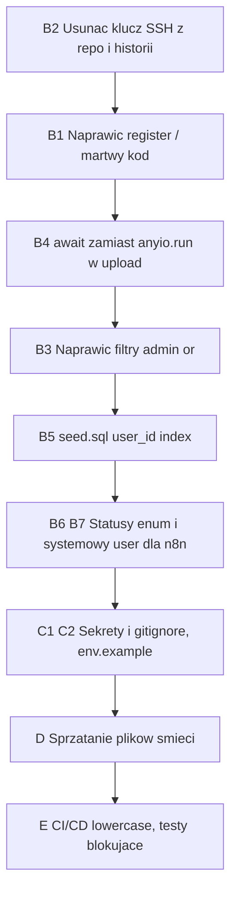

# EDM ZCO — Audyt kodu, zmiennych środowiskowych i plików (aktualizacja)

**Data:** 2026-07-05
**Zakres:** backend, frontend, docker-compose, pliki .env, CI/CD (GitHub Actions), pliki repozytorium
**Kontekst architektury (wg deklaracji):** frontend + backend lokalnie w osobnych kontenerach Docker (porty 3002/8001 — dev), PostgreSQL na zewnętrznej maszynie (Spark, 192.168.1.34), n8n na zewnętrznej maszynie (webhook), wdrożenie na DGX Spark przez GitHub Actions.

---

## A. Status poprzedniego audytu (plans/audit-report.md z 2026-06-07)

| # | Poprzednie znalezisko | Status |
|---|----------------------|--------|
| 1 | Brak kolumn `ocr_result`/`metadata` w modelu File | ✅ NAPRAWIONE — [`models.py:97-98`](backend/app/models.py:97), [`seed.sql:48-49`](backend/seed.sql:48) |
| 2 | `DocumentStatus.PROCESSED` nie istnieje | ✅ NAPRAWIONE — webhook używa `DocumentStatus.READY` |
| 3 | Hardcoded `127.0.0.1:8000` w file-queue | ✅ NAPRAWIONE — używa proxy `/api/...` |
| 4 | Duplikat `backend/main.py` | ✅ USUNIĘTY — nie ma pliku w repo |
| 5 | `size Float` vs `BIGINT` | ⚠️ CZĘŚCIOWO — model ma `Integer` ([`models.py:93`](backend/app/models.py:93)), seed ma `BIGINT`; dla plików do 100 MB Integer wystarcza, ale niespójność pozostaje |
| 6 | Brak endpointu rejestracji początkowej | ⚠️ DODANO `/register-setup`, ALE zepsuto `/register` (patrz B1) |
| 7 | React 19 / types 18 | ✅ NAPRAWIONE — React 18.3, Next 14.2, types 18.3 |
| 8 | Next.js 16 (nieistniejący) | ✅ NAPRAWIONE — `next: ^14.2.0` |
| 9 | `python-http-client` w requirements | ✅ USUNIĘTE |
| 10 | Domyślny `DOCLING_API_URL` niespójny | ⚠️ NADAL — [`config.py:39`](backend/app/config.py:39) `http://docling:8002`, ale compose nie definiuje serwisu `docling` |
| 11 | Brak `ON DELETE SET NULL` dla files.folder_id | ⚠️ CZĘŚCIOWO — model ma `ondelete="SET NULL"` ([`models.py:94`](backend/app/models.py:94)), seed.sql NIE ma ([`seed.sql:45`](backend/seed.sql:45)) |

---

## B. NOWE BŁĘDY KRYTYCZNE

### B1. [CRITICAL] Endpoint `/api/auth/register` ma PUSTE ciało
**Plik:** [`backend/app/auth/auth.py:14-16`](backend/app/auth/auth.py:14)
Funkcja `register_user` zawiera wyłącznie docstring — zwraca `None`, a `response_model=UserInDB` spowoduje **500 Internal Server Error** przy każdej próbie rejestracji przez admina.
Dodatkowo w `register_setup_user` po `return new_user` (linia 65) znajduje się **martwy kod** (linie 66-88) — to jest wycięte ciało starego `/register` wklejone do złej funkcji.
**Fix:** Przenieść logikę z linii 66-88 do `register_user` (z kontrolą `current_user.role == ADMIN`), usunąć martwy kod z `register_setup_user`.

### B2. [CRITICAL] Prywatny klucz SSH w repozytorium
**Plik:** [`spark-deploy/id_ed25519.spark`](spark-deploy/id_ed25519.spark)
Prywatny klucz SSH do maszyny Spark jest commitowany do repo (obok klucza publicznego). Jeśli repo trafiło na GitHub — klucz jest skompromitowany.
**Fix:** Usunąć z repo + wyczyścić historię git (`git filter-repo`), wygenerować NOWY klucz, stary unieważnić na Sparku (`authorized_keys`). `.gitignore` ma `*.key`/`*.pem`, ale nie łapie `id_ed25519.spark`.

### B3. [CRITICAL] Błędna logika filtrowania plików (Python `or` na wyrażeniu SQLAlchemy)
**Pliki:** [`backend/app/files/router.py:207`](backend/app/files/router.py:207), [`router.py:271-273`](backend/app/files/router.py:271), [`router.py:317-319`](backend/app/files/router.py:317)
```python
query = db.query(FileModel).filter(FileModel.uploaded_by == current_user.id or current_user.role == UserRole.ADMIN)
```
Python `or` ewaluuje truthiness wyrażenia SQLAlchemy (zawsze truthy) → warunek admina jest **ignorowany**. Efekt: **admin nie widzi cudzych plików** na listach `/`, `/queue`, `/status-summary` (m.in. plików zarejestrowanych przez n8n z `uploaded_by=0`).
**Fix:** `from sqlalchemy import or_` i warunkowo: jeśli admin → bez filtra, w przeciwnym razie `filter(FileModel.uploaded_by == current_user.id)`.

### B4. [CRITICAL] `anyio.run()` wewnątrz działającej pętli asyncio (upload)
**Plik:** [`backend/app/files/router.py:139-156`](backend/app/files/router.py:139)
`upload_file` jest `async def` — działa w event loopie. Wywołanie `anyio.run(call_webhook)` wewnątrz działającej pętli rzuca `RuntimeError: asyncio.run() cannot be called from a running event loop`. Wyjątek jest łapany przez zewnętrzny `try/except`, więc **każdy upload kończy się `webhook_success=False` → status ERROR**, nawet gdy n8n działa.
(W [`processing_queue/router.py:119`](backend/app/processing_queue/router.py:119) `retry_processing` jest sync `def` — tam `anyio.run` działa, dlatego retry przechodzi, a upload nie.)
**Fix:** W `upload_file` wywołać `await call_webhook()` bezpośrednio (funkcja już jest async).

### B5. [CRITICAL] `seed.sql` wywala się na nieistniejącej kolumnie
**Plik:** [`backend/seed.sql:138`](backend/seed.sql:138)
```sql
CREATE INDEX IF NOT EXISTS idx_folder_permissions_user ON folder_permissions(user_id);
```
Tabela `folder_permissions` **nie ma kolumny `user_id`** → skrypt przerywa się błędem, users/foldery/settings nie zostają zasiane przy inicjalizacji kontenera postgres.
**Fix:** Usunąć/poprawić indeks.

### B6. [HIGH] Niespójność wartości statusów: Enum ORM vs stringi w DB i webhooku
**Pliki:** [`models.py:18-25`](backend/app/models.py:18), [`webhooks/router.py:94`](backend/app/webhooks/router.py:94), [`seed.sql:47`](backend/seed.sql:47)
- SQLAlchemy `Enum(DocumentStatus)` domyślnie zapisuje **nazwy** (`PENDING`, `READY`...), a seed.sql ustawia default `'W kolejce (n8n)'` (wartość, nie nazwa).
- Webhook PATCH przypisuje surowy string od n8n (`payload.status`, np. `"Przetworzono"` lub `"PENDING"`) bezpośrednio do kolumny Enum → `LookupError`/błąd walidacji zależnie od tego, czy string pasuje do nazwy.
- Frontend filtruje po polskich wartościach, backend porównuje `FileModel.status == status` (string z query).
**Fix:** Ujednolicić: `Enum(DocumentStatus, values_callable=lambda e: [m.value for m in e])` lub mapować przychodzące stringi na członków enum w webhooku; naprawić default w seed.sql.

### B7. [HIGH] Webhook `file-notified` łamie FK: `uploaded_by=0`
**Plik:** [`backend/app/webhooks/router.py:64`](backend/app/webhooks/router.py:64)
`uploaded_by=0` — użytkownik o id=0 nie istnieje, kolumna ma FK NOT NULL → **IntegrityError** przy rejestracji pliku przez n8n.
**Fix:** Utworzyć użytkownika systemowego (np. `system`/`n8n`) w seed.sql i używać jego id, albo dopuścić NULL.

### B8. [HIGH] `N8N_WEBHOOK_URL` może być `None`
**Pliki:** [`config.py:38`](backend/app/config.py:38), [`settings/router.py:39-44`](backend/app/settings/router.py:39)
`os.getenv("N8N_WEBHOOK_URL")` bez defaulta. Gdy tabela `settings` jest pusta (a będzie, bo seed.sql pada — patrz B5) i env nie ustawiony (tak jest w `.env.dev`), `get_webhook_url()` zwraca `None` → `httpx.post(None)` wybucha; upload zawsze ERROR.
**Fix:** Walidacja + czytelny błąd/log; sensowny fallback lub wymuszenie konfiguracji w Settings.

---

## C. Zmienne środowiskowe i konfiguracja

### C1. [HIGH] Sekrety w repozytorium
- [`backend/.env`](backend/.env), [`backend/.env.dev`](backend/.env.dev), [`backend/.env.spark`](backend/.env.spark), [`backend/.env.spark-db`](backend/.env.spark-db), [`frontend/.env`](frontend/.env) są w drzewie mimo wpisów w `.gitignore` — najpewniej były dodane zanim wpisy powstały (git nie ignoruje już śledzonych plików).
- Hasło DB `tajne_haslo` i `SECRET_KEY=zco-edm-secret-key-change-in-production` powtórzone w ~8 miejscach (env, compose, README, seed.sql).
- **Fix:** `git rm --cached` dla env-ów, dodać `backend/.env.example` (README już się na niego powołuje — plik NIE istnieje), wygenerować produkcyjny SECRET_KEY i hasło DB, trzymać w sekretach GitHub/na Sparku.

### C2. [HIGH] Zepsuta linia w `.gitignore`
[`.gitignore:55`](.gitignore:55) — samotny `!` w linii 55, a `!.env.example` (linia 56) jest oddzielone; wzorce negacji nie działają zgodnie z intencją.

### C3. [MEDIUM] CORS: `*` razem z `allow_credentials=True`
[`backend/.env:10`](backend/.env:10) zawiera `...,*` w `ALLOWED_ORIGINS`, a [`main.py:34-40`](backend/app/main.py:34) ustawia `allow_credentials=True`. Specyfikacja CORS zabrania `*` z credentials — przeglądarki odrzucą odpowiedzi; dodatkowo `*` w produkcji to ryzyko.

### C4. [MEDIUM] Niespójne porty/hosty Postgresa w różnych plikach
| Plik | DATABASE_URL host:port |
|------|------------------------|
| [`backend/.env`](backend/.env:2) | `127.0.0.1:15432` |
| [`backend/.env.dev`](backend/.env.dev:8) | `192.168.1.34:5433` |
| [`backend/.env.spark`](backend/.env.spark:9) | `172.17.0.7:5432` (kruchy, hardcoded IP kontenera!) |
| [`docker-compose.yaml`](docker-compose.yaml:47) | `edm-zco-postgres:5432` (mapowanie hosta 15432) |
| [`docs/PROCESSING-FLOW.md`](docs/PROCESSING-FLOW.md:191) | `postgres_rag_container:5432` |

`.env.spark` z IP `172.17.0.7` przestanie działać po każdym restarcie kontenera postgres. Powinno być: nazwa serwisu w sieci docker lub `192.168.1.34:5433`.

### C5. [MEDIUM] Rozbieżność z deklarowaną architekturą: lokalny postgres w compose — DO WERYFIKACJI NA SPARKU
Użytkownik deklaruje: postgres WYŁĄCZNIE na zewnętrznej maszynie. Tymczasem [`docker-compose.yaml:71-92`](docker-compose.yaml:71) definiuje serwis `postgres` z profilami `["dev", "spark"]` — `--profile spark up` wystartuje DRUGĄ, lokalną bazę na Sparku obok właściwej. Użytkownik nie jest pewien stanu faktycznego.

**Wymagana weryfikacja na Sparku (SSH `marcin@192.168.1.34`):**
```bash
# 1. Które kontenery postgres działają i na jakich portach
docker ps --format 'table {{.Names}}\t{{.Image}}\t{{.Ports}}' | grep -i postgres

# 2. Do której bazy faktycznie łączy się backend produkcyjny
docker exec edm-backend env | grep DATABASE_URL

# 3. Porównanie zawartości baz (czy admin/users istnieją w obu?)
docker exec edm-zco-postgres psql -U postgres -d edmdatabase -c 'SELECT count(*) FROM users;'
# oraz analogicznie dla drugiego kontenera (np. postgres_rag_container, port 5433)
```
Po weryfikacji: zostawić JEDEN kanoniczny postgres, drugi usunąć z profilu `spark` w compose (lub całkiem), ujednolicić `DATABASE_URL` we wszystkich env (C4).

### C6. [LOW] `docker-compose.override.yml` odwołuje się do nieistniejącego serwisu
[`docker-compose.override.yml:3`](docker-compose.override.yml:3) używa klucza `edm-backend`, ale serwis nazywa się `backend` (container_name ≠ service name) → tworzy osobny, pusty serwis zamiast nadpisać wolumeny.

### C7. [LOW] `konfiguracja_orkiestracji.yaml` — zdublowane `http://http://`
[`konfiguracja_orkiestracji.yaml:28-29`](konfiguracja_orkiestracji.yaml:28) — `http://http://192.168.1.34/:6333`. Plik wygląda na przestarzały szkic — kandydat do usunięcia/przeniesienia do docs.

---

## D. Pliki-śmieci w repozytorium

W katalogu głównym znajdują się artefakty pomyłek terminala (PowerShell): **`$null`**, **`$null;`**, **`dy`**, **`spark`**, **`spark-de`**, katalog **`-p/`**. Plik `spark` to skrypt testowy bash, `spark-de` — fragment nazwy. Do usunięcia.
W `spark-deploy/` jest ~30 skryptów jednorazowych (fix-ssh, create_users w 5 wariantach, `route.ts.b64`, `test_body.json` itd.) — martwe artefakty debugowania, mylą przy utrzymaniu. Do przeglądu i usunięcia lub przeniesienia do `spark-deploy/archive/`.
Ponadto: [`frontend/src/app/api/[[...path]]/route.ts.tmp`](frontend/src/app/api/[[...path]]/route.ts.tmp), `docling/new/Dockerfile.txt`, testowe PDF-y w `shared_docs/` i `backend/shared_docs/` (dane! m.in. faktura i deklaracja współpracy — nie powinny być w git).

---

## E. CI/CD (GitHub Actions)

1. **[MEDIUM]** [`deploy-spark.yml:126`](.github/workflows/deploy-spark.yml:126) i `:179` — `images: ${{ env.REGISTRY }}/${{ github.repository }}/backend` — mimo komentarza o lowercase, `github.repository` (`Marcin-CCC/...`) zawiera wielkie litery; `docker/metadata-action` normalizuje je do lowercase, ale default w compose ([`docker-compose.yaml:24`](docker-compose.yaml:24)) `ghcr.io/Marcin-CCC/...` z wielkimi literami jest **niepoprawny** jako fallback (docker pull odrzuci uppercase). Zmienna `IMAGE_REPO` (linia 17) jest zdefiniowana i nieużywana.
2. **[MEDIUM]** Testy i lint mają `continue-on-error: true` + `|| true` — pipeline NIGDY nie zablokuje wdrożenia mimo czerwonych testów. Świadoma decyzja? Jeśli nie — usunąć.
3. **[LOW]** `bump-version` commituje do brancha podczas builda — wyścig z równoległymi pushami; wersja z `VERSION` nie jest przekazywana do `build-frontend`.
4. **[LOW]** Deploy nadpisuje `.env` na Sparku tylko tagami obrazów (linie 237-238) — pozostałe zmienne (SECRET_KEY, DATABASE_URL...) muszą istnieć w compose defaults, czyli sekrety produkcyjne żyją w defaults compose — patrz C1.

---

## F. Pozostałe uwagi (średnie/niskie)

1. **Cache ustawień per-proces** ([`settings/router.py:15-16`](backend/app/settings/router.py:15)) — przy >1 workerze uvicorn zmiana webhook URL nie propaguje do innych workerów do czasu `_load_cache_from_db`. Upload i retry przeładowują cache z DB przed użyciem, więc praktyczny wpływ mały, ale GET `/api/settings/` może pokazywać stare dane.
2. **`GET /api/files/categories` i `/folder/{id}/files` nieosiągalne** — zdefiniowane PO parametrycznym `/{file_id}` ([`files/router.py:335`](backend/app/files/router.py:335) vs `:460`); żądanie `categories` trafia w `/{file_id}` → 422. Przenieść przed routę parametryczną (tak jak zrobiono z `/queue`).
3. **`print()` debug w produkcji** ([`files/router.py:74`](backend/app/files/router.py:74)) oraz rozbudowane `console.log` z nagłówkami (w tym Authorization presence) w [`route.ts:36-74`](frontend/src/app/api/[[...path]]/route.ts:36) — wyciszyć w produkcji.
4. **Modele "Future Processing"** (`Document`, `ProcessingQueue`...) — endpoint `/api/processing-queue/` listuje pustą tabelę `processing_queue`, podczas gdy realna kolejka to `files.status`; frontend file-queue korzysta z `/api/files/queue` (dobrze), ale `retry` uderza w `/api/processing-queue/{file_id}/retry`, który operuje na `files` — mylące nazewnictwo, do udokumentowania/scalenia.
5. **`docs/PROCESSING-FLOW.md`** twierdzi "Upload NIE jest blokowany" przy niedostępnym n8n — kod robi odwrotnie (status ERROR + synchroniczne czekanie do 10 s). Dokumentację lub kod należy uzgodnić.
6. **README** — nieaktualne: odwołuje się do `.env.example` (brak pliku), portów 8083/3000 (dev używa 8001/3002), instrukcja `docker compose --profile dev up` nie odpala buildów dev (te są w `docker-compose.dev.yaml`).
7. **JWT w localStorage** + brak refresh tokenów, brak rate-limitingu logowania — bez zmian od poprzedniego audytu.
8. **`docling/`** w repo, ale żaden compose nie buduje tego serwisu; `DOCLING_API_URL` wskazuje różne miejsca w każdym env. Do wyjaśnienia czy Docling żyje wyłącznie na Sparku (compose `spark-deploy/docker-compose-spark-services.yaml`?).

---

## G. Podsumowanie priorytetów napraw



| Priorytet | Pozycje |
|-----------|---------|
| Natychmiast (bezpieczeństwo) | B2, C1, C2 |
| Krytyczne (funkcjonalność) | B1, B3, B4, B5, B6, B7, B8 |
| Średnie | C3-C6, E1-E2, F1-F5 |
| Porządkowe | C7, D, E3-E4, F6-F8 |
