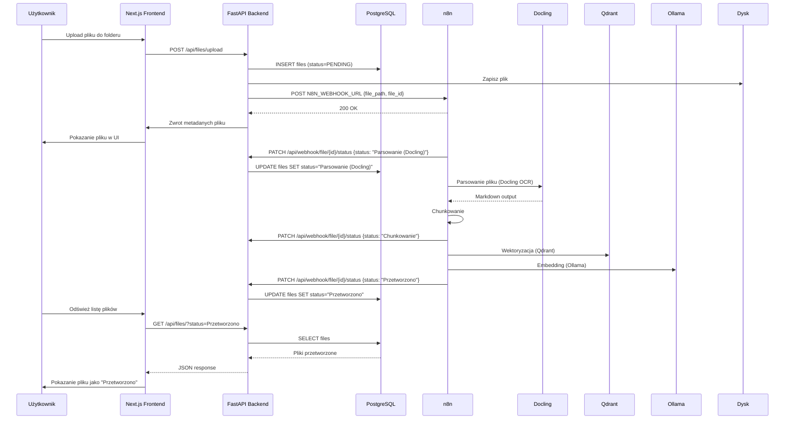

# Plan Naprawczy - Logika Aplikacji EDM ZCO

**Data:** 2026-06-07  
**Status:** Do zatwierdzenia  
**Cel:** Naprawić rozbieżności między opisanym flow a rzeczywistą implementacją

---

## 1. Analiza Obecnej Implementacji vs Opisane Flow

### Opisane Flow (user):
```
1. Użytkownik ładuje plik → status "W kolejce (n8n)"
2. n8n jest powiadamiany
3. n8n potwierdza przyjęcie → status "Parsowanie (Docling)"
4. n8n kończy parsowanie → status "Chunkowanie"
5. n8n kończy chunkowanie → status "Wektoryzacja (Qdrant)"
6. n8n kończy wektoryzację → status "Przetworzono"
7. Błąd → status "Błąd przetwarzania"
```

### Rzeczywiste Flow (kod):
```
1. Użytkownik ładuje plik → status "W kolejce (n8n)" ✅
2. ❌ n8n NIE jest powiadamiany (brak wywołania webhook)
3. ❌ Brak endpointu /api/processing-queue/
4. ❌ Statusy w UI nie pokrywają się z DocumentStatus enum
5. ❌ Brak endpointu PUT /files/{id} do aktualizacji metadanych
```

---

## 2. Plan Naprawczy - Todo List

### FIX #1: Dodaj trigger do n8n po uploadzie pliku
**Priorytet:** 🔴 Krytyczny  
**Plik:** `backend/app/files/router.py` (endpoint `upload_file`)

**Opis:**  
Po zapisie pliku do bazy danych i na dysk, backend musi wywołać webhook n8n (`N8N_WEBHOOK_URL`), aby powiadomić go o nowym pliku do przetworzenia.

**Zmiany:**
```python
# Dodaj import na górze pliku
import httpx

# W funkcji upload_file(), po db.commit() i db.refresh():
# ...existing code...
db.refresh(db_file)

# >>> NOWY CODE: Powiadom n8n o nowym pliku <<<
try:
    async with httpx.AsyncClient(timeout=10) as client:
        await client.post(
            settings.N8N_WEBHOOK_URL,
            json={"file_path": db_file.file_path, "file_id": db_file.id},
        )
except Exception:
    pass  # Ignoruj błędy n8n - nie blokuj uploadu
# <<< KONIEC NOWEGO CODE >>>

folder_obj = db_file.folder
# ...reszta kodu...
```

**Zależności:**  
- Wymaga importu `settings` z `app.config`
- Wymienia `httpx` (już jest w requirements)

---

### FIX #2: Stwórz endpoint `/api/processing-queue/`
**Priorytet:** 🔴 Krytyczny  
**Plik:** `backend/app/` (nowy plik `processing_queue/router.py`)

**Opis:**  
Frontend w [`file-queue/page.tsx`](frontend/src/app/dashboard/file-queue/page.tsx:39) odwołuje się do `/api/processing-queue/`, który nie istnieje. Endpoint musi zwracać dane z tabeli `processing_queue` z join do `documents`.

**Struktura pliku `backend/app/processing_queue/router.py`:**
```python
"""Processing Queue Router - endpointy dla kolejki przetwarzania."""
from fastapi import APIRouter, Depends, HTTPException, Query
from sqlalchemy.orm import Session
from sqlalchemy import and_
from typing import List, Optional

from app.database import get_db
from app.models import ProcessingQueue, Document
from app.auth.auth import get_current_user

router = APIRouter(prefix="/api/processing-queue", tags=["Processing Queue"])


@router.get("/")
def list_processing_queue(
    status: Optional[str] = Query(None),
    skip: int = Query(0, ge=0),
    limit: int = Query(200, ge=1, le=500),
    db: Session = Depends(get_db),
    current_user = Depends(get_current_user),
):
    """List processing queue items with document info."""
    query = db.query(ProcessingQueue).join(Document)
    if status:
        query = query.filter(ProcessingQueue.status == status)
    items = query.order_by(ProcessingQueue.created_at.desc()).offset(skip).limit(limit).all()
    
    result = []
    for item in items:
        result.append({
            "id": item.id,
            "document_id": item.document_id,
            "file_name": item.document.filename if item.document else "unknown",
            "status": item.status,
            "page_count": item.document.chunks_count if item.document else 0,
            "error_message": item.error_message,
            "created_at": item.created_at.isoformat() if item.created_at else None,
            "updated_at": item.created_at.isoformat() if item.created_at else None,
            "started_at": item.started_at.isoformat() if item.started_at else None,
            "completed_at": item.completed_at.isoformat() if item.completed_at else None,
        })
    return result


@router.get("/{item_id}")
def get_processing_queue_item(item_id: int, ...):
    """Get single processing queue item."""
    ...


@router.post("/{item_id}/retry")
def retry_processing(item_id: int, ...):
    """Retry processing for a queue item."""
    ...


@router.post("/{item_id}/skip-page")
def skip_page(item_id: int, page_number: int, ...):
    """Skip a specific page in processing."""
    ...
```

**Rejestracja w [`main.py`](backend/app/main.py):**
```python
from app.processing_queue.router import router as processing_queue_router
app.include_router(processing_queue_router)
```

---

### FIX #3: Dodaj endpoint `PUT /files/{file_id}` do aktualizacji metadanych
**Priorytet:** 🟡 Wysoki  
**Plik:** `backend/app/files/router.py`

**Opis:**  
Schema `FileUpdate` istnieje w [`schemas.py:86`](backend/app/schemas.py:86), ale brak endpointu routera.

**Kod:**
```python
@router.put("/{file_id}", response_model=FileResponseSchema)
def update_file(
    file_id: int,
    file_update: FileUpdate,
    db: Session = Depends(get_db),
    current_user: User = Depends(get_current_user),
):
    """Update file metadata (status, folder). Admin only."""
    if current_user.role != UserRole.ADMIN:
        raise HTTPException(status_code=403, detail="Tylko administrator może aktualizować pliki.")
    
    file_obj = db.query(FileModel).filter(FileModel.id == file_id).first()
    if not file_obj:
        raise HTTPException(status_code=404, detail="Plik nie istnieje.")
    
    update_data = file_update.model_dump(exclude_unset=True)
    for field, value in update_data.items():
        setattr(file_obj, field, value)
    
    db.commit()
    db.refresh(file_obj)
    
    # Return response (ten sam co get_file)
    ...
```

---

### FIX #4: Uzupełnij style CSS dla wszystkich statusów
**Priorytet:** 🟡 Wysoki  
**Plik:** `frontend/src/app/dashboard/file-queue/page.tsx`

**Opis:**  
`getStatusClass()` sprawdza statusy, które nie istnieją w `DocumentStatus`, i ignoruje rzeczywiste statusy.

**Zmiany w [`getStatusClass()`](frontend/src/app/dashboard/file-queue/page.tsx:98):**
```typescript
const getStatusClass = (status: string) => {
  switch (status) {
    case 'W kolejce (n8n)':
      return 'bg-yellow-100 text-yellow-800';
    case 'Parsowanie (Docling)':      // ← NOWY
      return 'bg-orange-100 text-orange-800';
    case 'Chunkowanie':                // ← NOWY
      return 'bg-blue-100 text-blue-800';
    case 'Wektoryzacja (Qdrant)':      // ← NOWY
      return 'bg-purple-100 text-purple-800';
    case 'W trakcie przetwarzania':
      return 'bg-blue-100 text-blue-800';
    case 'Przetworzono':
      return 'bg-green-100 text-green-800';
    case 'Błąd przetwarzania':
      return 'bg-red-100 text-red-800';
    case 'Pominięto':
      return 'bg-gray-100 text-gray-800';
    default:
      return 'bg-gray-100 text-gray-800';
  }
};
```

---

### FIX #5: Zaktualizuj seed.sql o brakujące kolumny w tabeli files
**Priorytet:** 🟢 Średni  
**Plik:** `backend/seed.sql`

**Opis:**  
Tabela `files` w seed.sql nie ma kolumn `ocr_result` i `metadata`, które są w modelu SQLAlchemy.

**Zmiany:**
```sql
-- ZAMIASENT:
CREATE TABLE IF NOT EXISTS files (
    ...
    status VARCHAR(50) NOT NULL DEFAULT 'W kolejce (n8n)',
    created_at TIMESTAMP WITHOUT TIME ZONE DEFAULT CURRENT_TIMESTAMP,
    updated_at TIMESTAMP WITHOUT TIME ZONE DEFAULT CURRENT_TIMESTAMP
);

-- NA:
CREATE TABLE IF NOT EXISTS files (
    id SERIAL PRIMARY KEY,
    filename VARCHAR(500) NOT NULL,
    file_path VARCHAR(1000) NOT NULL,
    mime_type VARCHAR(100),
    size BIGINT,
    folder_id INTEGER REFERENCES folders(id),
    uploaded_by INTEGER REFERENCES users(id) NOT NULL,
    status VARCHAR(50) NOT NULL DEFAULT 'W kolejke (n8n)',
    ocr_result TEXT,                    -- ← NOWY
    metadata JSONB,                     -- ← NOWY
    created_at TIMESTAMP WITHOUT TIME ZONE DEFAULT CURRENT_TIMESTAMP,
    updated_at TIMESTAMP WITHOUT TIME ZONE DEFAULT CURRENT_TIMESTAMP
);
```

---

### FIX #6: Stwórz dokumentację flow dla deweloperów
**Priorytet:** 🟢 Niski  
**Plik:** `docs/PROCESSING-FLOW.md` (nowy plik)

**Opis:**  
Stwórz dokumentację opisującą pełny flow przetwarzania dokumentów, aby przyszli deweloperzy rozumieli jak system działa.

---

## 3. Diagram Flow po Naprawie



---

## 4. Lista Plików do Modyfikacji

| # | Plik | Zmiana | Priorytet |
|---|------|--------|-----------|
| 1 | `backend/app/files/router.py` | Dodaj trigger n8n po uploadzie | 🔴 Krytyczny |
| 2 | `backend/app/processing_queue/router.py` | **NOWY** - endpoint kolejki | 🔴 Krytyczny |
| 3 | `backend/app/main.py` | Rejestracja routing processing_queue | 🔴 Krytyczny |
| 4 | `backend/app/files/router.py` | Dodaj PUT /{file_id} endpoint | 🟡 Wysoki |
| 5 | `frontend/src/app/dashboard/file-queue/page.tsx` | Uzupełnij CSS statusów | 🟡 Wysoki |
| 6 | `backend/seed.sql` | Dodaj brakujące kolumny | 🟢 Średni |
| 7 | `docs/PROCESSING-FLOW.md` | **NOWY** - dokumentacja flow | 🟢 Niski |

---

## 5. Testy do Wykonania po Naprawie

1. **Upload test:**
   - Zaloguj się jako admin
   - Załaduj plik PDF do folderu
   - Sprawdź w logach backendu, że n8n otrzymał webhook
   - Sprawdź status w DB: powinien być "W kolejce (n8n)"

2. **Webhook test:**
   - Stwórz workflow w n8n triggerowany webhookiem
   - N8n powinien odbierać `file_path` i `file_id`
   - N8n powinien aktualizować status przez PATCH /api/webhook/file/{id}/status

3. **Queue page test:**
   - Otwórz stronę "Kolejka plików"
   - Powinny wyświetlać się elementy z `processing_queue`
   - Filtrowanie po statusie powinno działać

4. **Status UI test:**
   - Każdy status powinien mieć odpowiedni kolor
   - "Parsowanie (Docling)" → pomarańczowy
   - "Chunkowanie" → niebieski
   - "Wektoryzacja (Qdrant)" → fioletowy

---

## 6. Potencjalne Problemy i Rozwiązania

### Problem 1: n8n może być niedostępny
**Rozwiązanie:**  
Timeout 10s na wywołanie webhooka + try/catch. Jeśli n8n jest niedostępny, upload nie jest blokowany.

### Problem 2: Duplekacja rekordów - `files` vs `documents` vs `processing_queue`
**Rozwiązanie:**  
Doraźne: użyj `files` jako głównej tabeli. Długoterminowo: rozważ migrację do struktury `documents` + `processing_queue`.

### Problem 3: Brak autoryzacji na endpointach processing_queue
**Rozwiązanie:**  
Dodaj `get_current_user` dependency i check uprawnień.

---

## 7. Harmonogram (kolejność implementacji)

1. **Fix #1** - Trigger n8n (15 min)
2. **Fix #2** - Endpoint processing-queue (30 min)
3. **Fix #4** - CSS statusów w UI (10 min)
4. **Fix #3** - PUT /files/{file_id} (15 min)
5. **Fix #5** - seed.sql sync (5 min)
6. **Fix #6** - Dokumentacja (20 min)

**Całkowity czas:** ~1.5 godziny
